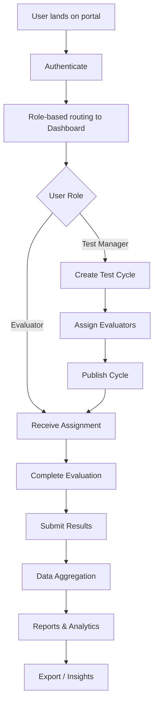

## 1. Product Overview
Digital Test & Evaluation Portal (DTEP) is a professional platform for managing test cycles, evaluations, and quality assurance workflows. It provides teams with a centralized environment to plan, execute, and track test evaluations with a focus on clarity, precision, and efficiency.

- Primary purpose: Streamline test management and evaluation workflows for teams; target users are QA engineers, test managers, and product teams
- Target value: Reduce evaluation cycle times by 40% through centralized tracking, real-time analytics, and collaborative evaluation pipelines

## 2. Core Features

### 2.1 User Roles
| Role | Registration Method | Core Permissions |
|------|---------------------|------------------|
| Admin | Invitation + SSO | Full system administration, user management, full CRUD on all resources |
| Test Manager | Invitation | Create test cycles, assign evaluators, view reports, manage templates |
| Evaluator | Invitation / self-signup with approval | Execute assigned tests, submit evaluations, view own dashboard |
| Viewer | Invitation | Read-only access to reports and dashboards |

### 2.2 Feature Module
1. **Landing Page**: hero value proposition, feature highlights, CTA section, footer
2. **Dashboard**: overview metrics, recent activity, test cycles summary, evaluation status
3. **Test Cycles**: list view, create/edit cycle modal, cycle detail view
4. **Evaluations**: evaluation form, scoring rubric, submission workflow
5. **Reports & Analytics**: performance charts, trend analysis, export capabilities

### 2.3 Page Details
| Page Name | Module Name | Feature description |
|-----------|-------------|---------------------|
| Landing Page | Hero section | Bold headline with editorial typography, primary CTA button, subtle background texture |
| Landing Page | Feature Highlights | 3-4 feature cards with icons, staggered reveal animation on scroll |
| Dashboard | Metrics Grid | 4 key metric cards (pass rate, cycles completed, pending evaluations, avg score |
| Dashboard | Recent Activity | Timeline of recent actions with user avatars |
| Dashboard | Test Cycles Table | Filterable table with status badges, pagination, search |
| Test Cycles | Create Cycle Modal | Form with date picker, evaluator assignment, template selection |
| Evaluations | Detail View | Scoring rubric, comment sections, save draft / submit actions |
| Reports | Analytics Charts | Line chart for trends, bar chart for category breakdowns |

## 3. Core Process
A user lands on the portal, authenticates, and lands on their personalized dashboard. From the dashboard, a Test Manager can create a new Test Cycle by defining parameters, assigning evaluators, and selecting templates. Evaluators receive notifications, complete their assigned evaluations using structured rubrics, and submit results. All data flows into Reports & Analytics for real-time visualization and export.

## 4. User Interface Design
### 4.1 Design Style
- Primary colors: Warm cream (#FAF7F2), soft beige (#E8E1D5), deep charcoal (#2A2A28), muted olive (#6B7C5E)
- Accent color: Terracotta (#B4593E as subtle accents
- Button style: Pill-shaped with soft rounded corners (12px radius), soft drop-shadow, hover micro-interaction with subtle lift
- Typography: Editorial serif display font (Fraunces or Playfair Display) for headlines; clean geometric sans (Sora for body; generous line-height 1.6
- Layout style: Generous whitespace, 8px spacing system, large rounded cards (24px radius), asymmetric grid layouts
- Icon style: Lucide icons, thin stroke weight 1.5px, warm charcoal stroke

### 4.2 Page Design Overview
| Page Name | Module Name | UI Elements |
|-----------|-------------|-------------|
| Landing Page | Hero section | Left-aligned headline H1 (6xl font-serif), cream background, subtle paper texture, staggered text reveal animation |
| Landing Page | Feature Cards | 3-column grid on desktop, cards with olive/beige alternating backgrounds, 24px radius, hover shadow-xl soft shadow, scale-on-hover |
| Dashboard | Metrics Grid | 2x2 metric cards, charcoal numbers in serif display, subtle borders, hover reveal on page load |
| Dashboard | Navigation | Left sidebar navigation, cream background, charcoal icons, active state with olive accent bar |
| Test Cycles | Table | Clean data table, alternating row shades, status badges with pill shape, olive for active, charcoal for neutral |
| Reports | Charts | Subtle grid lines, olive/terracotta data series, smooth transitions on data update |

### 4.3 Responsiveness
- Desktop-first design approach, breakpoints at 1280px, 1024px, 768px, 640px
- Collapsible sidebar on tablet (< 1024px collapses to icon-only nav
- Mobile adaptation: stacked layouts for grids, full-width cards, touch targets ≥ 48px for mobile
- Touch optimization: hover states replaced with active states on touch devices, scroll snap for horizontal elements

### 4.4 3D Scene Guidance
Not applicable — this is a 2D editorial UI-focused application
