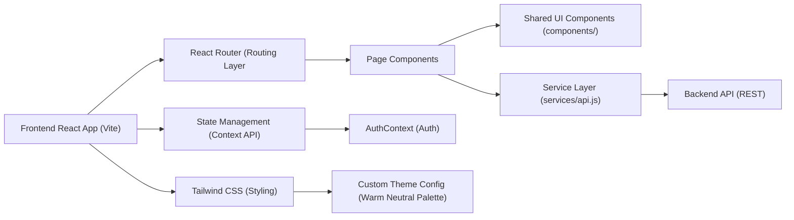
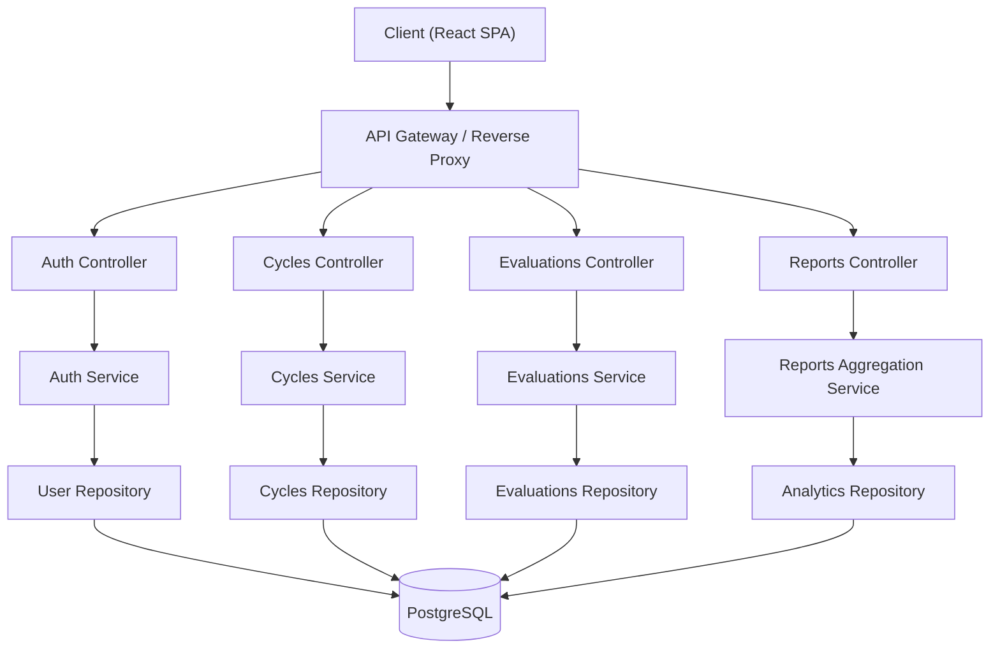
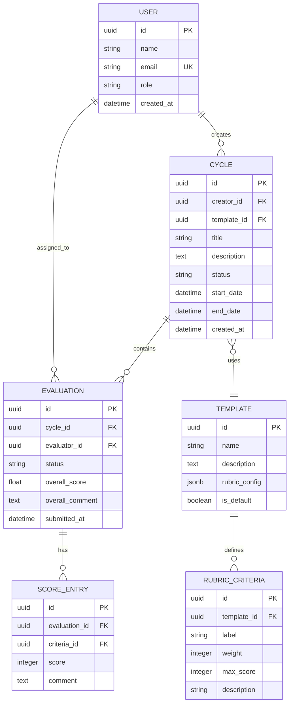

## 1. Architecture Design



## 2. Technology Description
- Frontend: React@18 + tailwindcss@3.4 + vite@5
- Initialization Tool: npm create vite@latest frontend -- --template react
- Backend: None (frontend-only scaffold with mock layer in api.js, ready for REST backend integration)
- State Management: React Context API for auth state, local component state with useState/useReducer
- HTTP Client: axios@1.x for API requests with interceptors for auth headers
- Icons: lucide-react for consistent iconography
- Routing: react-router-dom@6 for client-side routing
- CSS Strategy: Tailwind CSS v3 with @tailwindcss/vite plugin for Vite integration
- Typography: Google Fonts — Fraunces (serif display for editorial), Sora (sans-serif body)

## 3. Route Definitions
| Route | Purpose |
|-------|---------|
| / | Landing page with hero, features, CTA |
| /dashboard | Main dashboard with metrics, activity, cycles overview |
| /cycles | Test cycles list and management |
| /cycles/:id | Individual test cycle detail view |
| /evaluations | Evaluations inbox for current user |
| /evaluations/:id | Evaluation form / scoring view |
| /reports | Analytics and reports dashboard |
| /login | Authentication page |
| * | 404 Not Found page |

## 4. API Definitions (Backend Integration Contract)

### API Service Base
Service file: src/services/api.js

```javascript
// axios instance with baseURL and interceptors
import axios from 'axios';

const api = axios.create({
  baseURL: import.meta.env.VITE_API_BASE_URL || '/api',
  timeout: 15000,
});

// Request interceptor — attach auth token
api.interceptors.request.use((config) => {
  const token = localStorage.getItem('dtep_token');
  if (token) {
    config.headers.Authorization = `Bearer ${token}`;
  }
  return config;
});
```

### Auth Endpoints
| Method | Endpoint | Request | Response |
|--------|----------|---------|----------|
| POST | /auth/login | `{ email, password }` | `{ token, user: { id, name, role, email } }` |
| POST | /auth/logout | — | `{ success: true }` |
| GET | /auth/me | — | `{ id, name, role, email }` |

### Test Cycles Endpoints
| Method | Endpoint | Request | Response |
|--------|----------|---------|----------|
| GET | /cycles | query params: status, page, limit | `{ data: Cycle[], pagination }` |
| GET | /cycles/:id | — | `Cycle` with evaluations |
| POST | /cycles | `{ title, description, startDate, endDate, templateId, evaluatorIds }` | `Cycle` |
| PATCH | /cycles/:id | Partial<Cycle> | `Cycle` |
| DELETE | /cycles/:id | — | `{ success: true }` |

### Evaluations Endpoints
| Method | Endpoint | Request | Response |
|--------|----------|---------|----------|
| GET | /evaluations | query params: cycleId, assignedTo | `{ data: Evaluation[] }` |
| GET | /evaluations/:id | — | `Evaluation` with rubric |
| POST | /evaluations/:id/submit | `{ scores, comments }` | `Evaluation` (status: submitted) |
| PATCH | /evaluations/:id/draft | `{ scores, comments }` | `Evaluation` (status: draft) |

### Reports Endpoints
| Method | Endpoint | Request | Response |
|--------|----------|---------|----------|
| GET | /reports/summary | — | `{ passRate, totalCycles, avgScore, pending }` |
| GET | /reports/trends | query params: range (30d/90d/1y) | `{ labels: string[], data: number[] }` |

## 5. Server Architecture Diagram (Backend Placeholder)


## 6. Data Model
### 6.1 Data Model Definition



### 6.2 Data Definition Language

```sql
CREATE EXTENSION IF NOT EXISTS "pgcrypto";

CREATE TABLE users (
    id UUID PRIMARY KEY DEFAULT gen_random_uuid(),
    name VARCHAR(255) NOT NULL,
    email VARCHAR(255) UNIQUE NOT NULL,
    role VARCHAR(50) NOT NULL CHECK (role IN ('admin', 'manager', 'evaluator', 'viewer')),
    password_hash VARCHAR(255) NOT NULL,
    created_at TIMESTAMPTZ DEFAULT NOW()
);

CREATE TABLE templates (
    id UUID PRIMARY KEY DEFAULT gen_random_uuid(),
    name VARCHAR(255) NOT NULL,
    description TEXT,
    rubric_config JSONB NOT NULL DEFAULT '{}',
    is_default BOOLEAN DEFAULT FALSE
);

CREATE TABLE rubric_criteria (
    id UUID PRIMARY KEY DEFAULT gen_random_uuid(),
    template_id UUID REFERENCES templates(id) ON DELETE CASCADE,
    label VARCHAR(255) NOT NULL,
    weight INTEGER NOT NULL DEFAULT 1,
    max_score INTEGER NOT NULL DEFAULT 5,
    description TEXT
);

CREATE TABLE cycles (
    id UUID PRIMARY KEY DEFAULT gen_random_uuid(),
    creator_id UUID REFERENCES users(id),
    template_id UUID REFERENCES templates(id),
    title VARCHAR(255) NOT NULL,
    description TEXT,
    status VARCHAR(50) NOT NULL DEFAULT 'draft' CHECK (status IN ('draft', 'active', 'completed', 'archived')),
    start_date TIMESTAMPTZ,
    end_date TIMESTAMPTZ,
    created_at TIMESTAMPTZ DEFAULT NOW()
);

CREATE TABLE evaluations (
    id UUID PRIMARY KEY DEFAULT gen_random_uuid(),
    cycle_id UUID REFERENCES cycles(id) ON DELETE CASCADE,
    evaluator_id UUID REFERENCES users(id),
    status VARCHAR(50) NOT NULL DEFAULT 'pending' CHECK (status IN ('pending', 'in_progress', 'submitted')),
    overall_score DECIMAL(5,2),
    overall_comment TEXT,
    submitted_at TIMESTAMPTZ
);

CREATE TABLE score_entries (
    id UUID PRIMARY KEY DEFAULT gen_random_uuid(),
    evaluation_id UUID REFERENCES evaluations(id) ON DELETE CASCADE,
    criteria_id UUID REFERENCES rubric_criteria(id),
    score INTEGER NOT NULL CHECK (score >= 0),
    comment TEXT
);

CREATE INDEX idx_cycles_status ON cycles(status);
CREATE INDEX idx_evaluations_cycle ON evaluations(cycle_id);
CREATE INDEX idx_evaluations_evaluator ON evaluations(evaluator_id);
CREATE INDEX idx_evaluations_status ON evaluations(status);
```
